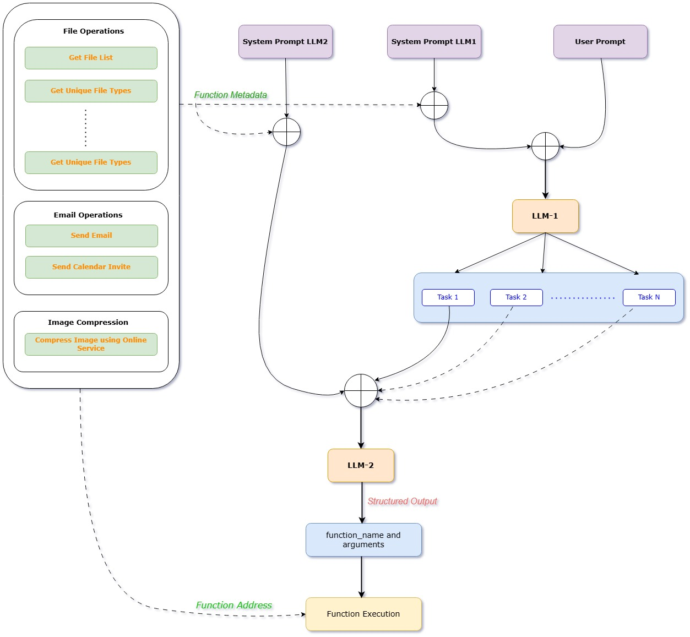

# EPAiV5-Capstone2 - AI Agent: Intelligent Task Execution

## Overview

This intelligent AI-powered system leverages Google's Gemini AI to efficiently organize files and execute complex tasks. It employs a dual-LLM architecture with a real-time web interface for task execution and monitoring.

## Core Features

### AI Architecture

#### Dual LLM System:

  - LLM1 (Task Decomposer): Breaks down complex tasks into manageable subtasks

  - LLM2 (Task Executor): Converts subtasks into precise function calls and executes them

#### Google Gemini AI Integration:

  - Uses the gemini-2.0-flash model for task execution

  - Zero-temperature responses ensure deterministic and reliable behavior

  - Structured prompt engineering enables accurate function execution

### File Organization

#### Intelligent Categorization:

  - Images: jpg, jpeg, png, gif, bmp, svg, ico

  - Documents: txt, doc, docx, pdf, ppt, pptx, xls, xlsx, csv

  - Code Files: py, ipynb

#### Dynamic Directory Management:

  - Automatic folder creation based on file types

  - Smart file type detection and sorting

  - Read-only file handling

### Web Interface

#### Real-time Monitoring:

  - Live execution logs

  - Progress tracking

  - Task status updates

#### User-friendly Interface:

  - Simple task input

  - Detailed execution feedback

  - Error reporting

### Technical Architecture

#### Agent Workflow Diagram



#### Core Components

  - Main Agent (main.py)

    - Task orchestration

    - Function registry management

    - Result aggregation and reporting

  - LLM Operations (LLM_ops.py)

    - Google Gemini AI integration

    - Prompt management

    - Response processing

    - Error handling

  - Function Operations (function_ops.py)

    - Dynamic function loading

    - Argument parsing

    - Function execution

    - Type safety

  - Web Interface (gradio_interface.py)

    - Gradio-based UI

    - Real-time logging

    - Thread-safe execution

    - Queue-based log management

## Installation

### Prerequisites

- Python 3.12 or higher

- Google Gemini AI API Key

- Required Python packages:


```
pip install -r requirements.txt
```

## Setup

1. Clone the repository:

```
git clone https://github.com/mHemaAP/EPAiV5-Capstone2.git
cd EPAiV5-Capstone2
```

2. Install dependencies:

```
pip install -r requirements.txt
```

3. Configure environment variables:

```
cp .env.example .env
echo "GOOGLE_API_KEY=your_api_key_here" > .env
echo "EMAIL_PASSWORD=your_email_password_here" > .env
```

## Project Structure


```
EPAiV5-CapStone/
├── main.py                # Main AI agent logic
├── LLM_ops.py             # LLM task decomposition and execution
├── function_ops.py        # Function registry and execution
├── gradio_interface.py    # Web interface for task execution
├── functions/ 
│   ├── file_ops.py        # File organization functions
│   ├── email_services.py  # Email and calendar services
│   ├── text_file_read.py  # Text file processing
│   ├── file_compression.py # Image compression operations
├── .env                   # Environment variables
├── requirements.txt       # Dependencies
└── README.md              # Documentation
```

## Architecture

#### LLM1 (Task Decomposer)

  - Receives user input

  - Analyzes task requirements

  - Breaks it down into subtasks

  - Formats output for LLM2

#### LLM2 (Task Executor)

  - Processes individual subtasks

  - Maps tasks to available functions

  - Executes operations

  - Handles errors and logging

#### File Operations

  - Directory scanning

  - File type identification

  - Folder creation and file movement

  - Automated file organization

#### Additional Features

  - Flexible Function Registry: Dynamically loads and manages available functions

  - Type-Safe Execution: Ensures valid argument types for function calls


## Usage

### Web Interface

    1. Start the Gradio interface:

```
python gradio_interface.py
```

2. Access the interface at http://localhost:7860.

3. Enter a task and click "Run Agent" to execute it

### Programmatic Usage


```
from main import run_agent

# Organize a folder
result = run_agent("Please organize the folder named 'un_organized'")

# Execute predefined tasks from perform_tasks.txt
result = run_agent("Read and execute tasks from perform_tasks.txt")

# Check execution results
if result["success"]:
    print("Task completed successfully")
    for subtask in result["subtasks"]:
        print(f"Subtask {subtask['id']}: {subtask['description']}")
        print(f"Result: {subtask['result']}")
else:
    print(f"Error: {result['error']}")
```

## Error Handling

This system robustly handles:

- FileNotFoundError

- PermissionError

- Read-only file conflicts

- Invalid function calls

- LLM response parsing errors

## Logging

A comprehensive logging system provides:

- Function entry/exit logs

- Task execution success/failure logs

- Detailed error tracing

- LLM responses and task breakdown logs

## License

This project is licensed under the MIT License - see the LICENSE file for details.

## Acknowledgments

- Google Gemini AI for LLM capabilities

- Python Community for essential libraries

- Rohan (EPAiV5 course) for the guidance and support


---------------------------------------------------------------------------------------------------------------------------------------------------

**Submission by** - Hema Aparna M

**mail id** - mhema.aprai@gmail.com

---------------------------------------------------------------------------------------------------------------------------------------------------